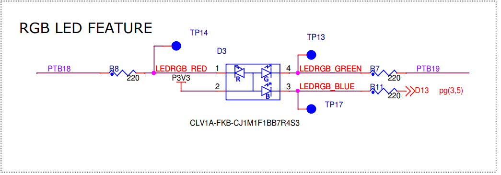

# Atividade 1  
### Nome: Felipe Martins Silveira Lima
### NUSP: 13681933

## 1. Por que os LEDs sao Active Low?

Porque, no esquematico da placa, os LEDs estao ligados de forma que o microcontrolador acende o LED drenando corrente pelo pino GPIO. Quando a saida fica em nivel baixo (`0`), existe diferenca de potencial sobre o LED e a corrente circula. Quando a saida fica em nivel alto (`1`), os dois lados ficam no mesmo potencial (3.3V) e o LED apaga.

No Zephyr isso aparece como `GPIO_ACTIVE_LOW` no DeviceTree. Essa flag informa ao driver que o valor logico `1` significa "ativo/aceso", mesmo que o nivel eletrico real no pino seja `0`.

`led0` -> `gpiob, pino 19`  
`led1` -> `gpiod, pino 1`  
`led2` -> `gpiob, pino 19`  



## 2. Quais funcoes foram usadas para acender e apagar os LEDs?

Foram usadas estas funcoes da API GPIO do Zephyr:

- `gpio_is_ready_dt()` para verificar se o controlador GPIO do LED esta pronto.
- `gpio_pin_configure_dt()` para configurar cada pino como saida, iniciando apagado com `GPIO_OUTPUT_INACTIVE`.
- `gpio_port_clear_bits_raw()` para colocar o bit fisico do GPIO em `0`.
- `gpio_port_set_bits_raw()` para colocar o bit fisico do GPIO em `1`.

O programa nao usa `gpio_pin_toggle_dt()` para alternar os LEDs. Como os LEDs sao `GPIO_ACTIVE_LOW`, a funcao `set_traffic_lights()` usa a regra direta: se o LED deve acender (`1`), chama `gpio_port_clear_bits_raw()`; se deve apagar (`0`), chama `gpio_port_set_bits_raw()`.

## 3. O que e o DeviceTree?

DeviceTree e uma descricao da plataforma de hardware usada pelo Zephyr. Ele informa ao sistema quais perifericos existem, seus enderecos, interrupcoes, pinos, clocks, estados e nomes simbolicos.

No codigo, em vez de escrever diretamente "porta B, pino 18", usamos macros como `DT_ALIAS(led2)` e `GPIO_DT_SPEC_GET(...)`. O Zephyr resolve isso em tempo de compilacao usando o `.dts` da placa e gera as estruturas corretas para o driver GPIO.

## 4. Quais abstracoes sao feitas pelo Sistema Operacional?

O Zephyr abstrai detalhes de baixo nivel do hardware. Neste programa, as principais abstracoes sao:

- DeviceTree: separa a descricao da placa do codigo da aplicacao.
- Driver GPIO: permite controlar pinos usando uma API comum, sem manipular registradores diretamente.
- `struct gpio_dt_spec`: junta porta, pino e flags eletricas em uma unica estrutura.
- Semantica active/inactive: `GPIO_ACTIVE_LOW` permite escrever `true` para acender, mesmo quando o nivel fisico e `0`.
- Kernel timing: `k_msleep()` suspende a thread pelo tempo desejado sem criar uma espera ocupada manual.
- `printk()`: fornece uma saida de log simples sem acessar diretamente a UART.

# Código

```c
#include <zephyr/kernel.h>
#include <zephyr/device.h>
#include <zephyr/drivers/gpio.h>


#define RED_TIME_MS 3000
#define GREEN_TIME_MS 3000
#define YELLOW_TIME_MS 1000

#define GREEN_LED_NODE DT_ALIAS(led0)
#define YELLOW_LED_NODE DT_ALIAS(led1)
#define RED_LED_NODE DT_ALIAS(led2)

#if !DT_NODE_HAS_STATUS(GREEN_LED_NODE, okay)
#error "Unsupported board: led0 devicetree alias is not defined"
#endif

#if !DT_NODE_HAS_STATUS(YELLOW_LED_NODE, okay)
#error "Unsupported board: led1 devicetree alias is not defined"
#endif

#if !DT_NODE_HAS_STATUS(RED_LED_NODE, okay)
#error "Unsupported board: led2 devicetree alias is not defined"
#endif

static const struct gpio_dt_spec green_led = GPIO_DT_SPEC_GET(GREEN_LED_NODE, gpios);
static const struct gpio_dt_spec yellow_led = GPIO_DT_SPEC_GET(YELLOW_LED_NODE, gpios);
static const struct gpio_dt_spec red_led = GPIO_DT_SPEC_GET(RED_LED_NODE, gpios);

enum traffic_state {
    TRAFFIC_RED,
    TRAFFIC_GREEN,
    TRAFFIC_YELLOW,
};

static int configure_led(const struct gpio_dt_spec *led)
{
    int ret;

    if (!gpio_is_ready_dt(led)) {
        printk("Error: LED device %s is not ready\n", led->port->name);
        return -ENODEV;
    }

    ret = gpio_pin_configure_dt(led, GPIO_OUTPUT_INACTIVE);
    if (ret < 0) {
        printk("Error %d: failed to configure LED on %s pin %d\n",
               ret, led->port->name, led->pin);
    }

    return ret;
}

static int set_traffic_lights(bool red, bool yellow, bool green)
{
    int ret;

    if (red == 1) {
        ret = gpio_port_clear_bits_raw(red_led.port, BIT(red_led.pin));
    } else {
        ret = gpio_port_set_bits_raw(red_led.port, BIT(red_led.pin));
    }
    if (ret < 0) {
        return ret;
    }

    if (yellow == 1) {
        ret = gpio_port_clear_bits_raw(yellow_led.port, BIT(yellow_led.pin));
    } else {
        ret = gpio_port_set_bits_raw(yellow_led.port, BIT(yellow_led.pin));
    }
    if (ret < 0) {
        return ret;
    }

    if (green == 1) {
        ret = gpio_port_clear_bits_raw(green_led.port, BIT(green_led.pin));
    } else {
        ret = gpio_port_set_bits_raw(green_led.port, BIT(green_led.pin));
    }

    return ret;
}

int main(void)
{
    enum traffic_state state = TRAFFIC_RED;

    if (configure_led(&red_led) < 0 ||
        configure_led(&yellow_led) < 0 ||
        configure_led(&green_led) < 0) {
        return 0;
    }

    while (1) {
        switch (state) {
        case TRAFFIC_RED:
            set_traffic_lights(true, false, false);
            k_msleep(RED_TIME_MS);
            state = TRAFFIC_GREEN;
            break;

        case TRAFFIC_GREEN:
            set_traffic_lights(false, false, true);
            k_msleep(GREEN_TIME_MS);
            state = TRAFFIC_YELLOW;
            break;

        case TRAFFIC_YELLOW:
            set_traffic_lights(true, false, true);
            k_msleep(YELLOW_TIME_MS);
            state = TRAFFIC_RED;
            break;
        }
    }

    return 0;
}
```

# Link do repositório